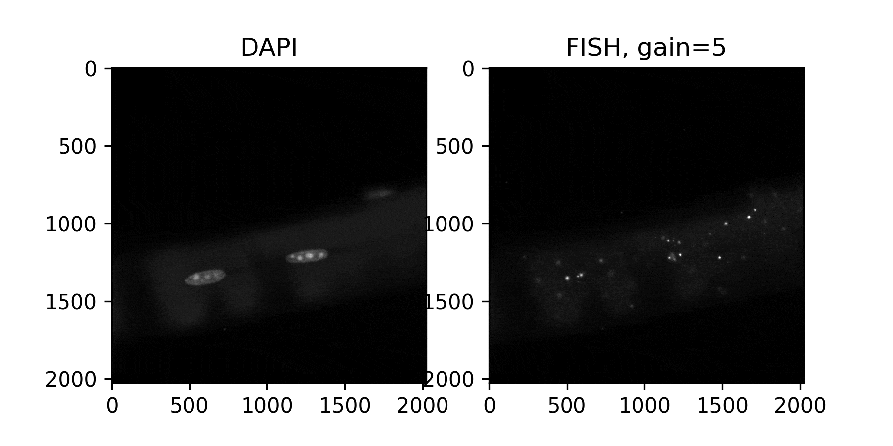
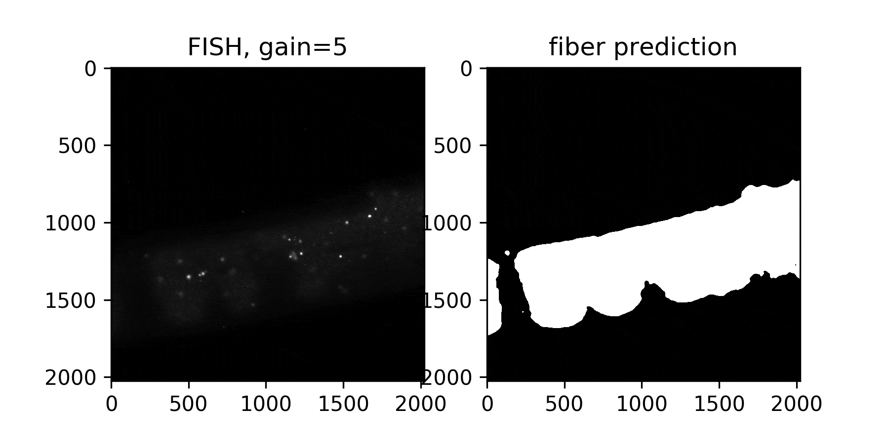
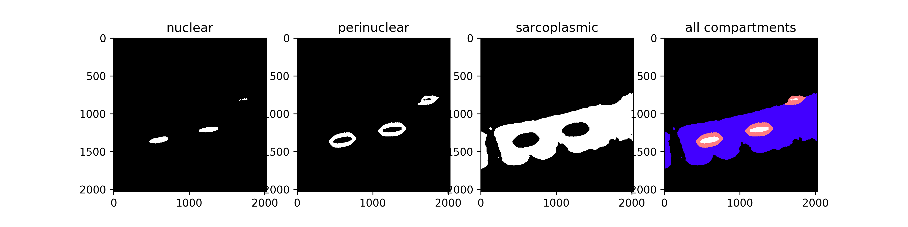
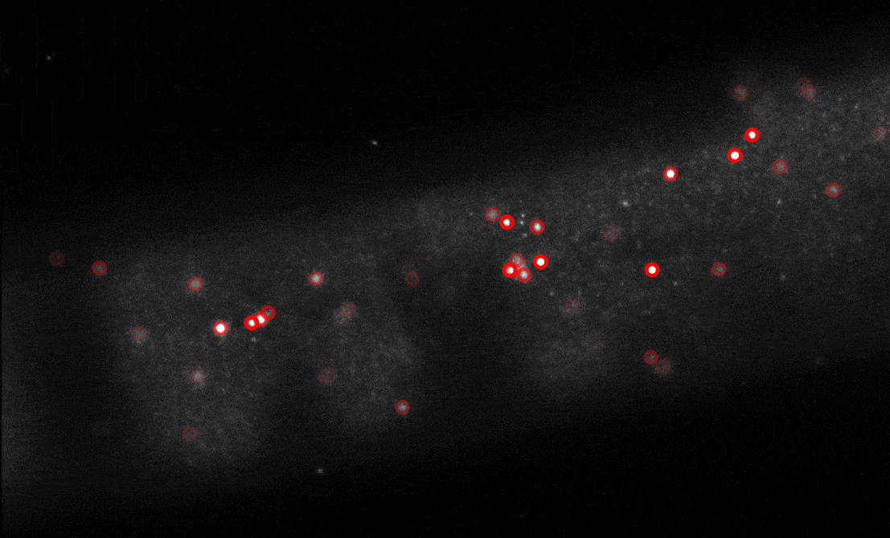

# Example HCR-FISH analysis

This basic example illustrates how we use our general Python pipeline to analyze 3D confocal microscopy images of myofibers. In this fiber, we used HCR-FISH to label mRNAs from the vinculin gene (Vcl), and we stained with DAPI to label nuclei:

After opening the image and separating the channels, we first segment the myofiber from the background slide. This is accomplished by thresholding on the background signal in the FISH channel, using [Li's method](https://scikit-image.org/docs/dev/auto_examples/developers/plot_threshold_li.html) of automatic threshold selection.

We next segment the nuclei by applying [Otsu's method](https://scikit-image.org/docs/dev/auto_examples/segmentation/plot_thresholding.html#id4) to threshold the DAPI channel. We also define the perinuclear region as a 2-um shell surrounding the nuclei, and we create a mask for this region by iterative [binary dilation](https://scikit-image.org/docs/dev/auto_examples/applications/plot_morphology.html) operations.

Once the regions have been defined, we use the [Laplacian of Gaussian approach](https://scikit-image.org/docs/dev/auto_examples/features_detection/plot_blob.html) to detect HCR-FISH spots. We also apply a signal-to-noise filter to eliminate low-intensity spots, reducing the number of false positive spot calls.

