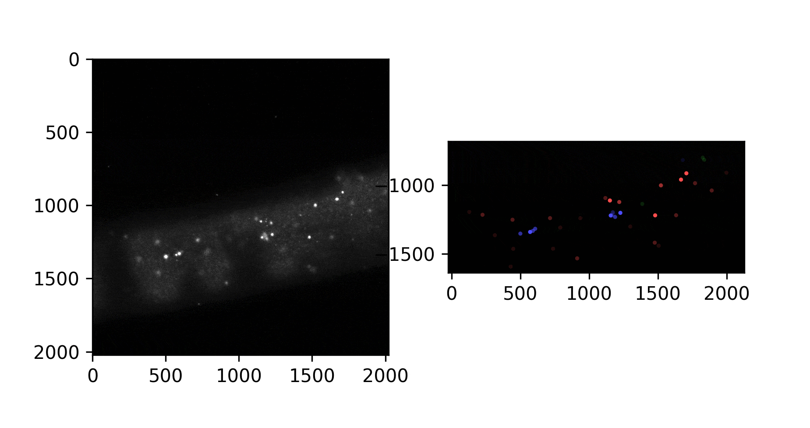

# Example HCR-FISH analysis

This basic example illustrates how we use our general Python pipeline to analyze 3D confocal microscopy images of myofibers. In this fiber, we used HCR-FISH to label mRNAs from the vinculin gene (Vcl), and we stained with DAPI to label nuclei.


After opening the image and separating the channels, we first segment the myofiber from the background slide. This is accomplished by thresholding on the background signal in the FISH channel, using [Li's method](https://scikit-image.org/docs/dev/auto_examples/developers/plot_threshold_li.html) of automatic threshold selection.


We next segment the nuclei by applying [Otsu's method](https://scikit-image.org/docs/dev/auto_examples/segmentation/plot_thresholding.html#id4) to threshold the DAPI channel. We also define the perinuclear region as a 2-um shell surrounding the nuclei, and we create a mask for this region by iterative [binary dilation](https://scikit-image.org/docs/dev/auto_examples/applications/plot_morphology.html) operations.


Once the regions have been defined, we use the [Laplacian of Gaussian approach](https://scikit-image.org/docs/dev/auto_examples/features_detection/plot_blob.html) to detect HCR-FISH spots. We also apply a signal-to-noise filter to eliminate low-intensity spots, reducing the number of false positive spot calls.


At this point, using the region masks, we assign spots to nuclear, perinuclear, and cytoplasmic compartments.



We calculate the volume of each region from the number of `True` elements in the mask and the voxel dimensions of the microscope image. With these volumes, we calculate the density of mRNAs in each region:

```
nuclear:      26 spots, 0.0164690731557966 spots/um^3, 10.92436974789916% of spots
perinuclear:  46 spots, 0.010984723351771131 spots/um^3, 19.327731092436974% of spots
(nuc + peri:  72 spots, 0.012486233580754902 spots/um^3, 30.252100840336134% of spots)
sarcoplasmic: 166 spots, 0.006026747805161343 spots/um^3, 69.74789915966386% of spots
```

With information from multiple images for each gene, we statistically test whether mRNAs from certain genes are enriched in a particular region.

We applied these basic techniques to analyze all images in our study. To address additional questions, we have also implemented methods to segment cytoskeletal structures from IF, detect intersections between cytoskeletal filaments, measure distances between objects, measure FISH spot intensities, and simulate motion of RNAs in muscle fibers. For more details, check out our [manuscript](https://www.biorxiv.org/content/10.1101/2021.02.26.433059v1).
