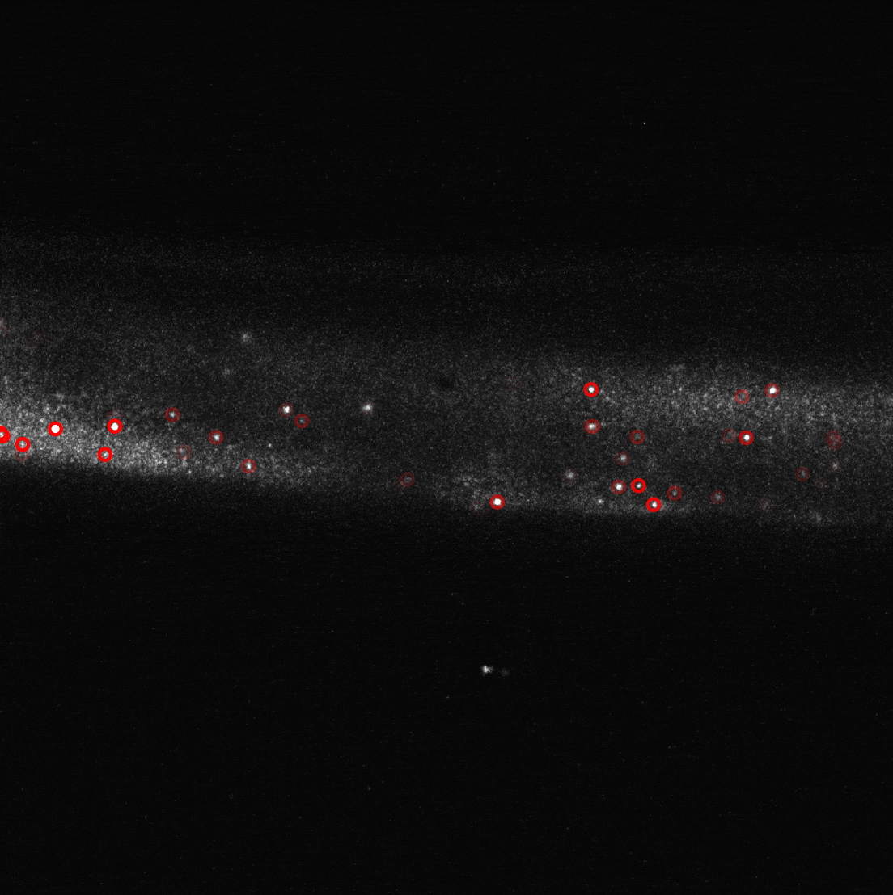

# General HCR-FISH analysis pipeline



## Description
This Python image analysis pipeline was developed to analyze confocal fluorescence microscopy images of HCR-FISH in _ex vivo_ skeletal muscle fibers. The pipeline processes images in the CZI and OME-TIFF formats.

## Analysis steps
1. open CZI image and separate channels
2. segment muscle fiber and nuclei by automated threshold selection
3. detect HCR FISH spots by Laplacian of Gaussian
4. calculate transcript density within nuclear, perinuclear, and cytoplasmic compartments

## Instructions
To analyze an image, run the following command:

```
python fish_analysis.py <image-path> <output-directory> <gene-name>
```

The following optional arguments can be provided:
- `-c`, `--channel`: Wavelength of channel containing FISH signal (default first channel)
- `-d`, `--dapi-threshold`: Override threshold value for nuclei segmentation
- `-f`, `--fiber-threshold`: Override threshold value for fiber segmentation
- `-s`, `--snr`: Override signal-to-noise threshold for spot detection in FISH channel
- `--plot`: Generate plots, images, and animations 
