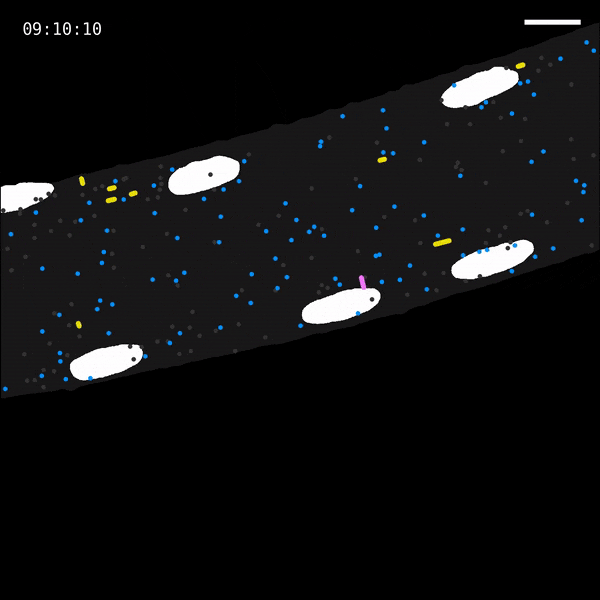
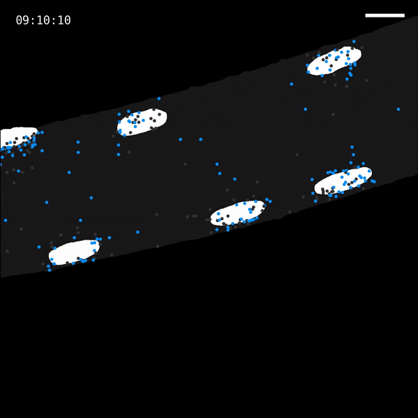
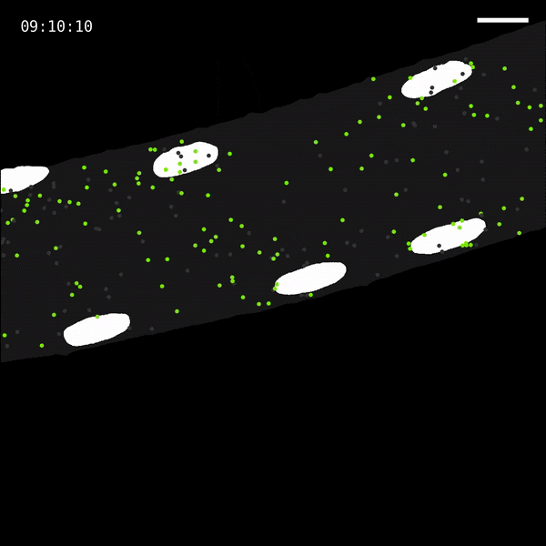

# Markovian simulation of RNA transport in muscle fibers



## Description
We developed a discrete-time Markov chain (DTMC)-based simulation to investigate how the different motion states available to RNAs affect their steady-state distribution in the myofiber cytoplasm. In the simulation, the following RNA transport states are modeled:

1. **low-mobility (L)**: a slow diffusion state with a low range of diffusion coefficients (median _D_: 3.9 x 10<sup>-4</sup> µm<sup>2</sup>/s)
2. **high-mobility (H)**: a fast diffusion state with a high range of diffusion coefficients (median _D_: 6.5 x 10<sup>-3</sup> µm<sup>2</sup>/s)
3. **crawling (C)**: a slow directed transport state in which RNAs inch along in the same direction (median speed: 0.11 μm/s)
4. **processive (P)**: a fast directed transport state in which RNAs travel quickly in the same direction (median speed: 0.63 μm/s)

In a C2C12 myotube model of muscle fibers, we observed RNAs moving in each of these states, and we measured diffusion coefficients and directed transport distances for each particle. The distributions of these measurements were smoothed and sampled to provide estimates for motion parameters in the simulation.

## Instructions
We simulate RNA transport dynamics within the geometries of real muscle fibers. To extract the fiber and nuclei masks from a myofiber FISH image, run the following:

```
python get_fiber_dimensions.py <image-path> <output-dir> <gene-names>
```

Additional options are available to override automatic threshold selection, if appropriate.

To start a simulation, run the following:

```
python simulate_transport.py <image-name> <input-dir> <gene-name> <output-dir>
```

where `input-dir` points to the folder containing the masks. Use the following optional arguments to adjust the simulation parameters:
- `-s`, `--states`: String describing allowed motion states (0 = L, 1 = H, 2 = C, 3 = P). Default "023".
- `-l`, `--length`: Length of simulation (hr). Default 1000. _We adjust this value according to the mRNA half-life of the studied gene. 1000 hr is a reasonable default for all but the most long-lived genes._
- `-t`, `--timestep`: Length of timestep (s). Default 10. _We do not recommend changing this, as directed transport runs are modeled as single-timestep events._
- `-a`, `--sample`: Number of timesteps between recorded output rows. If 1, save in animation-friendly format. Default 1. _Increase this number to conserve storage space._
- `-e`, `--events`: On-the-fly changes to simulation conditions, in the format `<t(hr)>:<states>,...`. eg. "200:0,500:023". Default "". _As an example, we use this to simulate microtubule depolymerization experiments._

## Examples
We simulated the motion of Polr2a mRNAs with different sets of allowed motion states:
1. **{L} only.** In this configuration, we observe the distribution of RNAs in the cytoplasm if RNAs can move only by diffusion.
    
    
2. **{L, C, P}.** Here, RNAs can transition between diffusion and directed transport states, according to the transition probabilities calculated from observations in our cell culture model.
    
3. **{H} only.** Upon careful observation in C2C12 myotubes, we believe that state H is an artifact caused by regions of immature sarcomere formation and incomplete differentiation. In this simulation, we investigate whether RNAs could reach near-uniform distribution in mature myofibers by diffusion alone if their diffusion coefficients resembled those observed in dividing cells, eg. fibroblasts.
    