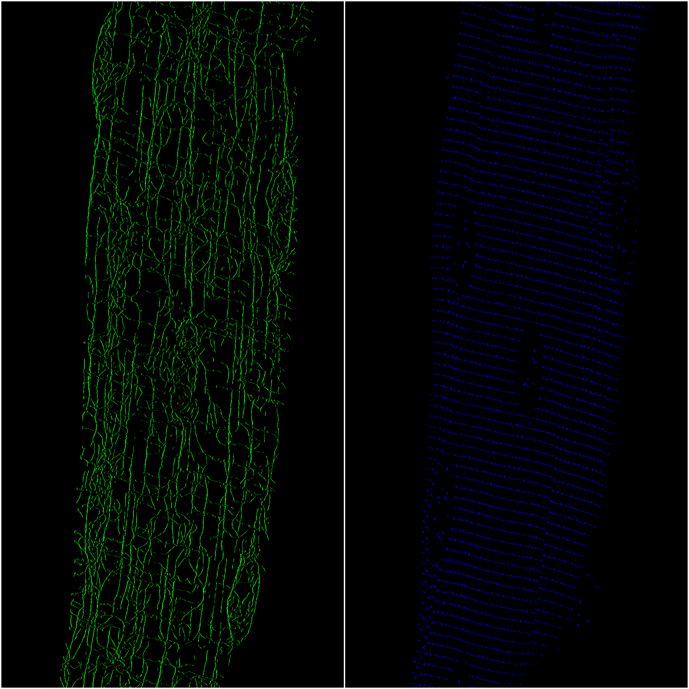
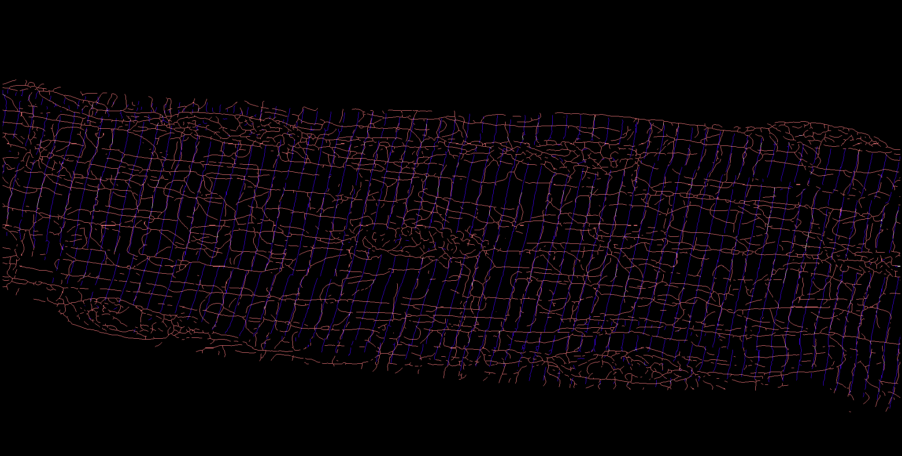
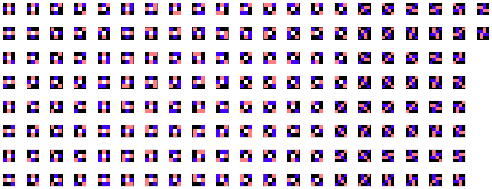
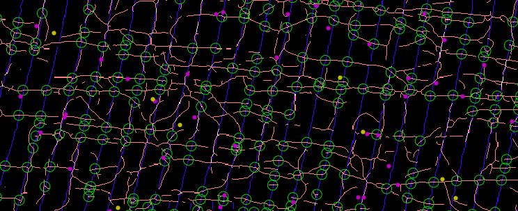

# Detection of Z-disk/microtubule intersections (ZMIs)

## Description
We found that RNAs in muscle fibers are preferentially associated with microtubules and Z-disks. In addition, we believed by observation that RNAs associated with these cytoskeletal structures appeared to be enriched at or near Z-disk/microtubule intersections (ZMIs). To study this quantitatively, we developed a novel approach to detect perpendicular intersections between two feature masks.

## Instructions
To detect ZMIs in a myofiber microscopy image, run the following:

```
python detect_zmi.py <zdisks-tiff> <microtubules-tiff> <nuclei-tiff> <spot-info> <gene-name>
```

where `zdisks-tiff`, `microtubules-tiff`, and `nuclei-tiff` point to TIFF files containing 3D binary masks generated by the Allen Cell and Structure Segmenter, and `spot-info` points to a text file with spot positions.

## Example
First, we use the [Allen Cell and Structure Segmenter](https://www.biorxiv.org/content/10.1101/491035v2) to segment Z-disks and microtubules, and we flatten the 3D arrays into 2D using maximum intensity projection:



To fill in gaps in the Z-disk mask, we perform a single [binary closing](https://scikit-image.org/docs/dev/auto_examples/applications/plot_morphology.html) operation. We then [skeletonize](https://scikit-image.org/docs/dev/auto_examples/edges/plot_skeleton.html) both masks. We merge the skeletons into a single mask, with the following possible values at each array position:
- **0**: neither skeleton
- **1**: Z-disk skeleton only
- **2**: microtubule skeleton only
- **3**: Z-disk and microtubule skeletons



To finalize the merged skeleton array, we exclude all pixels that fall within nuclei.

To identify ZMIs, we search the merged skeleton array for 3x3 and 4x4 subarrays ("motifs") that reflect perpendicular intersections between Z-disks and microtubules with high confidence. From 14 archetype motifs, we enumerate this set of 162 motifs by rotation, reflection, and swapping of microtubule and Z-disk values:



We use [template matching by fast normalized cross-correlation](https://scikit-image.org/docs/dev/auto_examples/features_detection/plot_template.html#id2) to efficiently search the merged skeleton array for all motifs. Perfect matches are called as ZMIs (visualized as green circles in this diagram, with FISH spots labeled in pink and yellow):



After ZMI detection, we measure the distances between cytoskeleton-associated FISH spots and ZMIs, and we compare these distances to a null distribution generated by randomizing spot positions along microtubules and Z-disks.